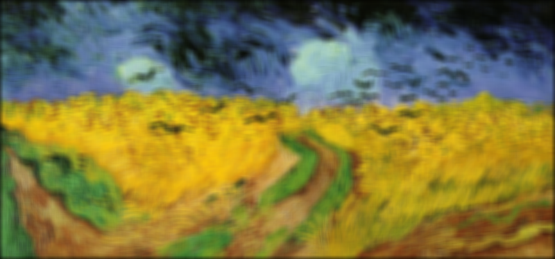

Name: David Fastovich
Email: fastovich@wisc.edu

Loading required packages and reading data to be processed later
```{r}
require("png")
require("parallel")
```

Filtering function:
This function works by taking X a character input, reading it as an image, creating a padded matrix, filtering that each of the three padded matrices (r, g, b), and then storing it in a list. This list is then used to generate an array in which the pictures are stored.

I did it this way because I found that running my original (just filtering) function in parallel was slower than running it my itself. By doing it this way I'm getting slightly (like 1 ms) better results and its slightly simpler because its one function that gets run on all three cores. I know this isn't exactly what homework stated to do so I have included a function that fulfills the homework requirements below this code chunk.
```{r}
par.chan.filtering <- function(x, k) {
  vg <- readPNG(x)
  dim.x <- dim(vg)
  filtered.list <- list()
  for (i in 1:3) {
    dim.y <- dim(vg[,,i])
    pad.X <- matrix(0, (dim.y[1]+2*k), (dim.y[2]+2*k))
    pad.X[(k+1):(dim.y[1]+k), (k+1):(dim.y[2]+k)] <- vg[,,i]
    filtered.mat <- matrix(0, dim(pad.X)[1], dim(pad.X)[2])
    for(row in (k+1):(dim.y[1]+k)) {
      for(col in (k+1):(dim.y[2]+k)) {
        filtered.mat[row, col] <- mean(pad.X[(row-k):(row+k),(col-k):(col+k)])
      }
    }
    unpadded.mat <- filtered.mat[seq_len(dim.x[1]) + k, seq_len(dim.x[2]) + k]
    
    filtered.list[[i]] <- unpadded.mat
  }
  return(filtered.list)
}
```

##This is the function as exactly required by the homework (those four bullets outlining exactly what it should do). You can tell that mean is set to sd() for edge detection but either way works.
```{r}
par.chan.filtering.edge <- function(x, k) {
  dim.x <- dim(x)
  pad.X <- matrix(0, (dim.x[1]+2*k), (dim.x[2]+2*k))
  pad.X[(k+1):(dim.x[1]+k), (k+1):(dim.x[2]+k)] <- x
  filtered.mat <- matrix(0, dim(pad.X)[1], dim(pad.X)[2])
  for(row in (k+1):(dim.x[1]+k)) {
    for(col in (k+1):(dim.x[2]+k)) {
      filtered.mat[row, col] <- sd(pad.X[(row-k):(row+k),(col-k):(col+k)])
    }
  }
  unpadded.mat <- filtered.mat[seq_len(dim.x[1]) + k, seq_len(dim.x[2]) + k]
  return(unpadded.mat)
}
```

Implementing function on Van_Gogh.png using 3 cores
```{r}
n.cores <- detectCores()
cluster <- makePSOCKcluster(names=n.cores)
clusterEvalQ(cl = cluster, expr = require(png))
filtered.list.1 <-  parLapply(cl = cluster, "Van_Gogh.png", par.chan.filtering, k = 1)
filtered.list.3 <-  parLapply(cl = cluster, "Van_Gogh.png", par.chan.filtering, k = 3)
filtered.list.5 <-  parLapply(cl = cluster, "Van_Gogh.png", par.chan.filtering, k = 5)
filtered.array.1 <- array(data = c(filtered.list.1[[1]][[1]], filtered.list.1[[1]][[2]], filtered.list.1[[1]][[3]]), dim = c(374, 800, 3))
filtered.array.3 <- array(data = c(filtered.list.3[[1]][[1]], filtered.list.3[[1]][[2]], filtered.list.3[[1]][[3]]), dim = c(374, 800, 3))
filtered.array.5 <- array(data = c(filtered.list.5[[1]][[1]], filtered.list.5[[1]][[2]], filtered.list.5[[1]][[3]]), dim = c(374, 800, 3))
writePNG(filtered.array.1, "fastovich_1.png")
writePNG(filtered.array.3, "fastovich_3.png")
writePNG(filtered.array.5, "fastovich_5.png")
```





Edge detection on "Van_Gogh.png" first
```{r}
# Reading data
vg <- readPNG("Van_Gogh.png")
red.vg <- vg[,,1]
green.vg <- vg[,,2]
blue.vg <- vg[,,3]

mad <- readPNG("Madison.png")
red.mad <- mad[,,1]
green.mad <- mad[,,2]
blue.mad <- mad[,,3]

# Edge detection then set everything greater than the 90% percentile standard deviation to white
red.vg.edge <- par.chan.filtering.edge(x = red.vg, k = 1)
red.vg[red.vg.edge >= (quantile(red.vg.edge, c(.90)))] <- 1

green.vg.edge <- par.chan.filtering.edge(x = green.vg, k = 1)
green.vg[green.vg.edge >= (quantile(green.vg.edge, c(.90)))] <- 1

blue.vg.edge <- par.chan.filtering.edge(x = blue.vg, k = 1)
blue.vg[blue.vg.edge >= (quantile(blue.vg.edge, c(.90)))] <- 1

vg.edge.array <- array(data = c(red.vg, green.vg, blue.vg), dim = c(dim(vg)[1], dim(vg)[2], dim(vg)[3]))

# Plotting each color to answer question
layout(matrix(1:3, ncol=3))
image(t(red.vg)[ncol(red.vg):1,])
image(t(green.vg)[ncol(green.vg):1,])
image(t(blue.vg)[ncol(blue.vg):1,])
layout(1)

writePNG(vg.edge.array, "edgevan.png")
```


**The crows are emphasized by the edges from the red channel.**

Edge detection on "Madison.png"
```{r}
# Reading data
mad <- readPNG("Madison.png")
red.mad <- mad[,,1]
green.mad <- mad[,,2]
blue.mad <- mad[,,3]

# Edge detection then set everything greater than the 90% percentile standard deviation to white
red.mad.edge <- par.chan.filtering.edge(x = red.mad, k = 1)
red.mad[red.mad.edge >= (quantile(red.mad.edge, c(.90)))] <- 1

green.mad.edge <- par.chan.filtering.edge(x = green.mad, k = 1)
green.mad[green.mad.edge >= (quantile(green.mad.edge, c(.90)))] <- 1

blue.mad.edge <- par.chan.filtering.edge(x = blue.mad, k = 1)
blue.mad[blue.mad.edge >= (quantile(blue.mad.edge, c(.90)))] <- 1

# Plotting each color to answer question
layout(matrix(1:3, ncol=3))
image(t(red.mad)[ncol(red.mad):1,])
image(t(green.mad)[ncol(green.mad):1,])
image(t(blue.mad)[ncol(blue.mad):1,])
layout(1)

mad.edge.array <- array(data = c(red.mad, green.mad, blue.mad), dim = c(dim(mad)[1], dim(mad)[2], dim(mad)[3]))
writePNG(mad.edge.array, "edgemad.png")
```

